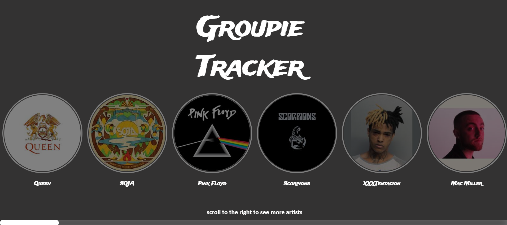

# Groupie-Tracker-Visualisations

## Objective
The aim of this project was to display information from an API on a user interface. The technologies used are: GoLang, HTML and CSS.

## Installation
To install this programme on your machine you need the latest version of `Golang` installed.

Once you have `Golang` installed run the following command:
`go run .`
 The programme will be running locally at [localhost:8080](http://localhost:8080)

